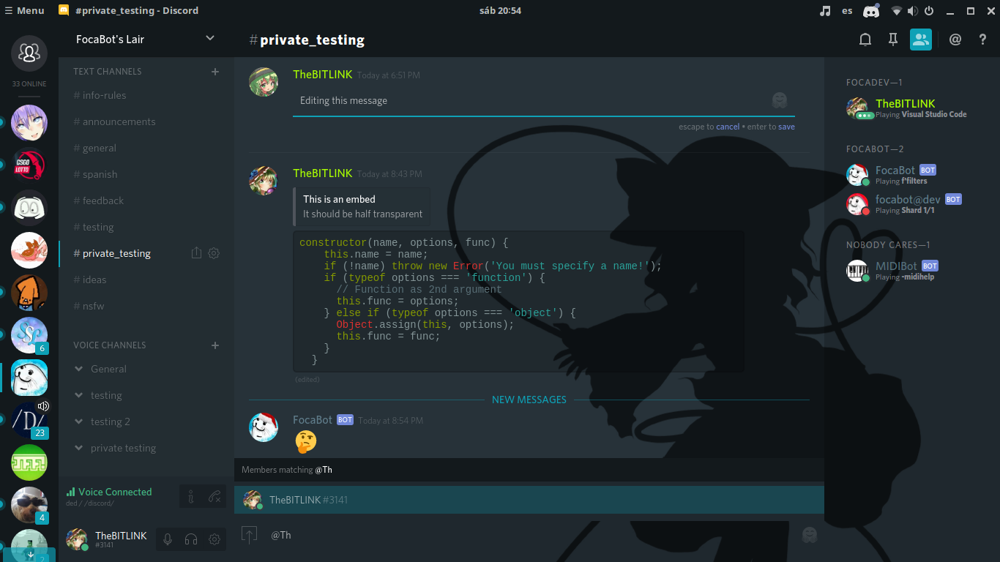

# Discord-Adapta
BeautifulDiscord theme based on the [Adapta Nokto](https://github.com/adapta-project/adapta-gtk-theme) GTK theme with optional character backgrounds.



## Variants

There are a few variants with custom colors and/or backgrounds. They're on the `variants` directory.

If you want to make a variant, **please do not edit the css files directly**, go to `src/variants`, make a copy
of an existing one, and edit as you please.

If you want to share a variant you made, go ahead! I'll accept most PRs as long as they don't break the build.

## Building

Builds are automatically done after each PR, but if you want to do it locally, follow these steps: (You'll need Node.js)

```bash
npm install -g stylus svg-stylus # dependencies
stylus -u svg-stylus src/variants -o variants
```

After running that, all variants in `src/variants` will be compiled to CSS files into the `variants` directory.

If you want to enable watch mode, pass a `-w` flag to the stylus executable.

Please note that the default variant will not be automatically copied to the project's root.
